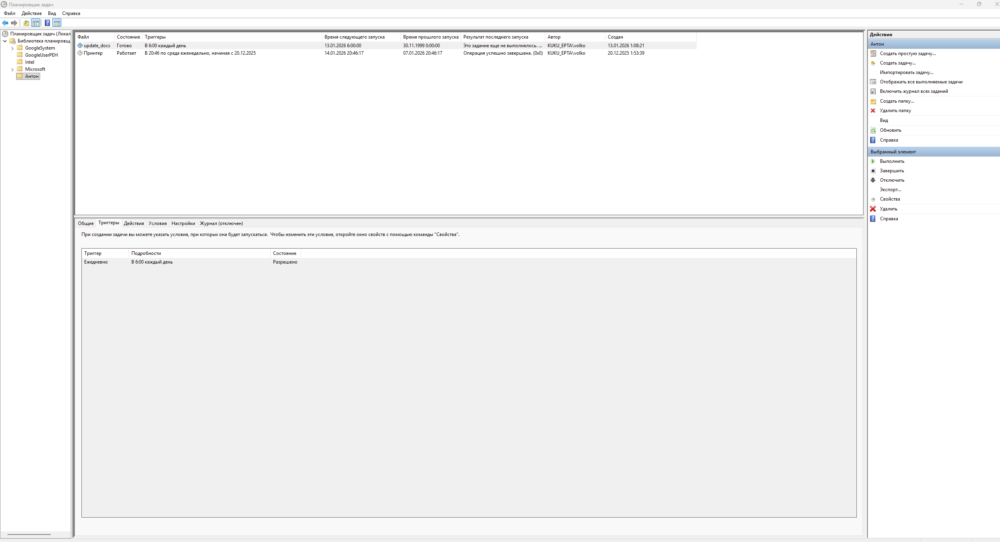
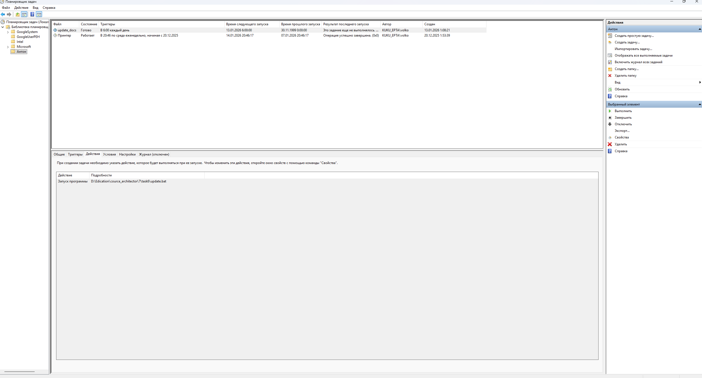

### Описание 
- сервисы
  - rag
    - на Python с ручкой /ask
    - эмбеддит запрос -> делает запрос в векторную БД -> готовит запрос промпт в LLM (Few-shot, CoT) -> отдает ручке ответ
  - telegram bot
    - на Java интеграция с Телеграммом, запрос в rag_service
  - скрипт обновления
    - запустить руками
      - выполнить task6/update.bat
    - либо добавить в cron/планировщик задач
      - 
      - 

### Запуск rag_service
- установить зависимости
```
pip install -r .\task4\rag_service\requirements.txt
.\.venv\Scripts\Activate.ps1
```
- запуск из корня 
```
uvicorn task6.rag_service.app:app --reload --port 8000
```

- проверка через ручку 127.0.0.1:8000/ask
```
> POST /ask HTTP/1.1
> Host: 127.0.0.1:8000
> Content-Type: application/json
> User-Agent: insomnia/12.2.0
> Accept: */*
> Content-Length: 64

| {
| 	"question":"Кто такая Валька Заварка?"
| }
```
